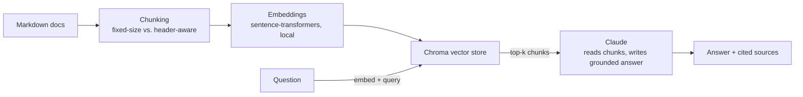

# RAG Docs Assistant

A retrieval-augmented Q&A assistant over FastAPI's tutorial documentation. Ask a plain-English question, get an answer grounded in the actual docs with a citation back to the source file, not a guess.

Built to demonstrate RAG fundamentals specifically: chunking as a real design decision (not a default you pick once and forget), a retrieval quality eval instead of an assumption, and an honest split between the embedding model (local, free) and the generation model (Claude).

## The problem

Point this at a real project's documentation and ask it questions a new developer would actually ask. The corpus here is 5 pages pulled directly from `tiangolo/fastapi`'s tutorial docs (first steps, path params, query params, request bodies, error handling).

## A note on embeddings vs. generation

Claude doesn't have a first-party embeddings endpoint, so this project uses two different tools for two different jobs: a local, free, open-source model (`sentence-transformers`, no API key) to turn text into vectors, and Claude to read the retrieved chunks and write the answer.

## Architecture



## Retrieval eval: fixed-size vs. header-aware chunking

15 hand-written questions (3 per doc), each paired with which file should answer it. For each chunking strategy, retrieval-only (no generation) was scored on whether the correct doc appeared in the top-k results.

| Strategy | hit_rate@3 | hit_rate@5 |
|---|---|---|
| Fixed-size (800 chars, 100 overlap) | **15/15 (100%)** | 15/15 (100%) |
| Header-aware (split on `#`/`##`/`###`) | 14/15 (93%) | 15/15 (100%) |

This is the opposite of what I expected going in — header-aware chunking is usually framed as the "smarter" choice, since each chunk is a coherent section instead of an arbitrary character window. But these docs have a lot of short, deeply-nested subsections (`###`, `####`), so header-based chunking sometimes produces chunks so small they lose keyword context. The one question header-aware missed at k=3 — "How does FastAPI validate that a path parameter is an integer?" — spans two adjacent header sections in `path-params.md` ("Path parameters with types" and "Data validation"), each mentioning only half of what the question asks about. Fixed-size chunking's overlapping windows happened to blend both sections into one chunk, capturing "integer" and "validate" together. At k=5 the gap disappears since header chunking's second-best chunk still lands in range.

The takeaway isn't "fixed-size chunking is better" as a general rule, it's that chunk size interacts with document structure, and the only way to know which one wins for a given corpus is to actually measure it instead of assuming.

## Sample Q&A

_(Illustrative — run `python -m src.rag header "How do I make a query parameter required?"` with your own `ANTHROPIC_API_KEY` to get a real captured exchange to drop in here.)_

```
> How do I make a query parameter required?

To make a query parameter required in FastAPI, simply don't declare a
default value for it. If you want it to be optional, set the default
to None; if you want a specific default, provide one. Leaving off the
default entirely makes the parameter required.

Sources: query-params.md
```

## Project structure

```
rag-docs-assistant/
├── data/docs/                 # 5 real markdown pages from tiangolo/fastapi
├── src/
│   ├── ingest.py                # loads docs, both chunking strategies
│   ├── embeddings.py             # sentence-transformers wrapper (local, no key)
│   ├── vector_store.py            # Chroma wrapper: add, query
│   └── rag.py                       # retrieve + build prompt + call Claude
├── eval/
│   ├── qa_set.json                    # 15 questions + expected source doc
│   └── score_retrieval.py              # hit-rate@k per chunking strategy
├── tests/                                # pytest, all mocked -- no API key or model download needed
├── .github/workflows/ci.yml                # runs the mocked test suite on every push
└── requirements.txt
```

## Running it

```bash
git clone https://github.com/DaleShockley/rag-docs-assistant.git
cd rag-docs-assistant
pip install -r requirements.txt

# unit tests (no keys, no model download -- fast)
pytest tests/ -v

# real retrieval eval (downloads a small local embedding model, no API key)
python -m eval.score_retrieval

# ask a real question (needs ANTHROPIC_API_KEY)
export ANTHROPIC_API_KEY=sk-...
python -m src.rag header "How do I make a query parameter required?"
```

## What's next

- Capture a real Claude-generated Q&A exchange for this README instead of the illustrative one above
- A third chunking strategy (semantic chunking via embedding similarity) added to the comparison
- Swap Chroma for pgvector to show working with a real database instead of an embedded one
- "I don't know" handling when retrieval comes back weak instead of forcing an answer
